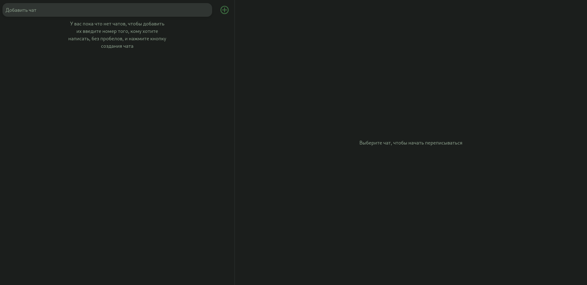
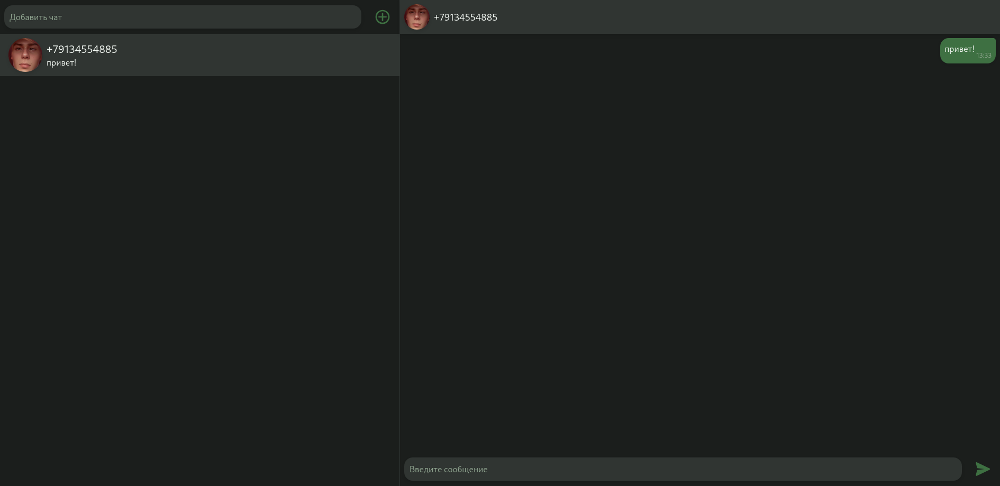

# Green Api Testwork
В этом репозитории представлен интерфейс для отправки сообщений по WhatsApp через GreenApi. Найти запущеный сайт можно по [ссылке]()

## Галерея

Страница входа в аккаунт(ввод idInstance и apiTokenInstance):


Главная страница без чатов:


Главная страница с чатом:


## Инструкция по запуску
Чтобы запустить проект у себя на компьютере вам понадобится yarn или npm(или другой package manager для js). Выполните следующие команды:
```sh
# Для yarn
yarn build
yarn preview
# Для npm
npm run build
npm run preview
```
После чего перейдите по [ссылке](http://localhost:4173)
